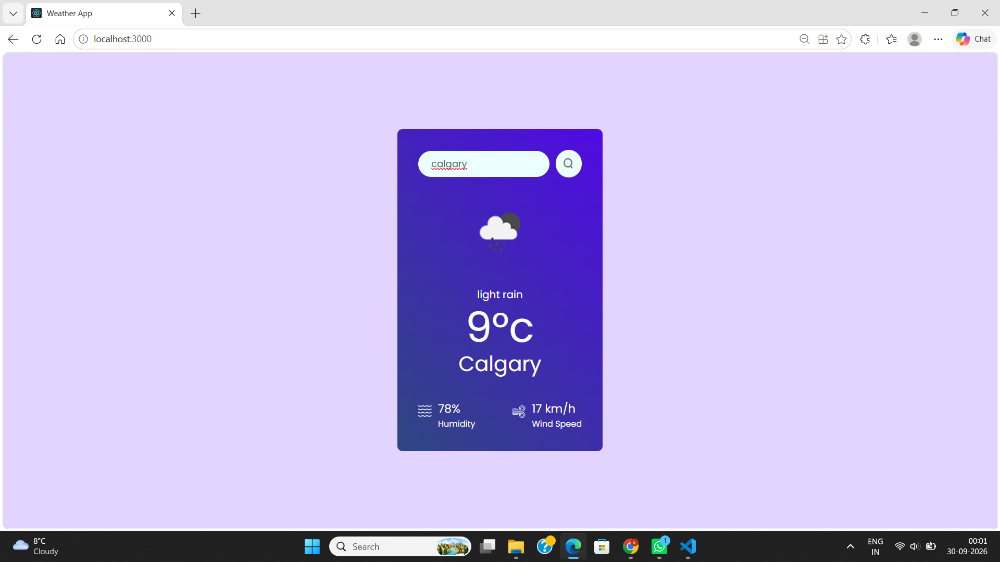

# Weather App

A simple weather application built with React that shows current weather conditions for any city in the world, using the OpenWeather API.

**Live demo:** [Weather App](https://weather-app-orcin-rho-dq7x7b276z.vercel.app/)

## Features

- Search for any city by name (click the search icon or press Enter)
- Shows current temperature, weather description, and weather icon
- Shows humidity and wind speed (in km/h)
- Handles empty searches and cities that can't be found

## Tech Stack

- React (Create React App)
- OpenWeather API
- JavaScript (ES6+)
- CSS

